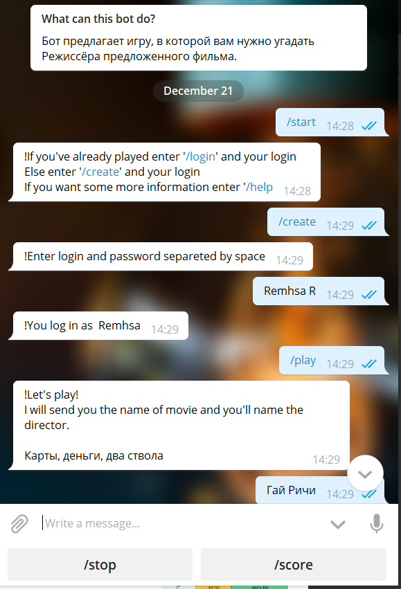

# Movie-Quizbot
Телеграмм бот для проведения викторин с тематикой о фильмах, написанный на Java 10.

### Идея
- Бот проводит викторину с игроком, отправляет ему названия фильма и ожидает получить Фамилию режиссёр данной картины.
- В боте реализована возможность создания аккаунта и сохранения прогресса, добавление профиля друзей и рейтинговая система.
- База с фильмами парсится с КиноПоиска.
- Был выполнен деплой бота на Heroku. 
 
### Изображение

### Цели
 1. Познакомиться с Java
 2. Работа с API
 3. Работа в команде
 4. Работа с GitHub
 5. Настройка проекта и deploy

>Проект собран в IntelliJ IDEA с использованием jdk-11.0.1

### Авторы
Ремша Игорь и Анна Макарова, 2019
